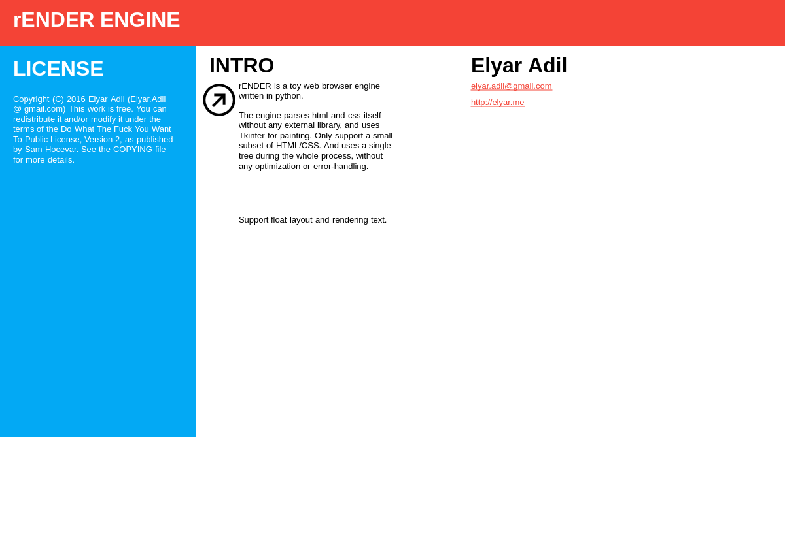
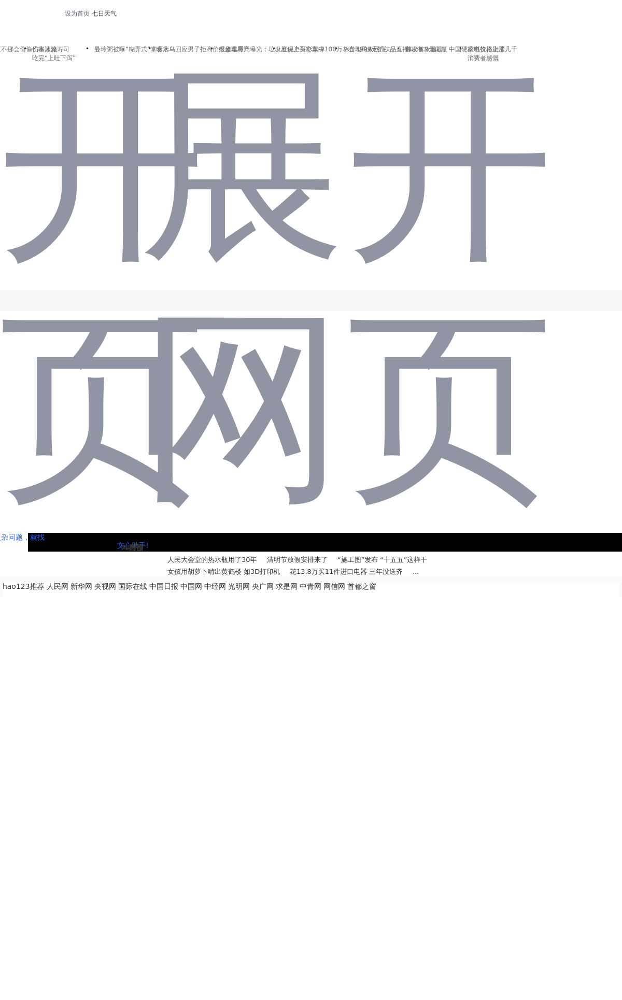

# rENDER

A minimal browser engine written in Python with PyQt6. Parses HTML/CSS from scratch and renders real web pages.

## Screenshots

### example/index.html


### example/hao123.html (Chinese portal)


## Usage

```bash
python engine.py                          # renders example/index.html
python engine.py example/index.html       # explicit file
python engine.py https://example.com      # fetch URL
```

## Architecture

```
html/parser.py         → DOM tree
css/cascade.py         → computed styles
layout/__init__.py     → display list of draw commands
rendering/qt_painter.py → QPainter execution
```

## Tests

```bash
python -m pytest tests/
```
