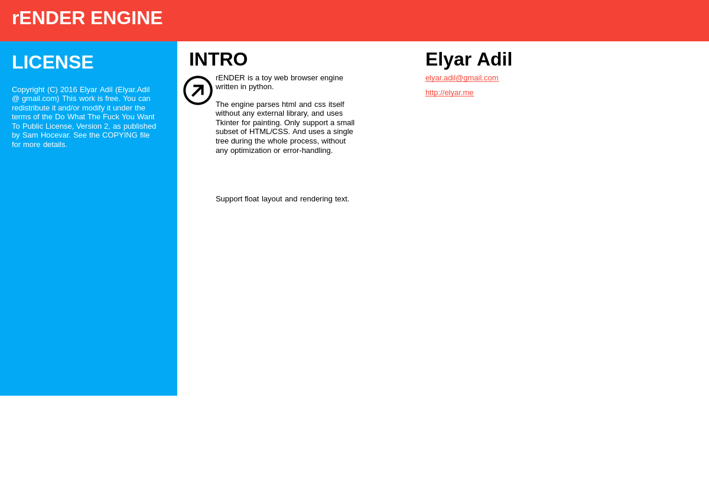
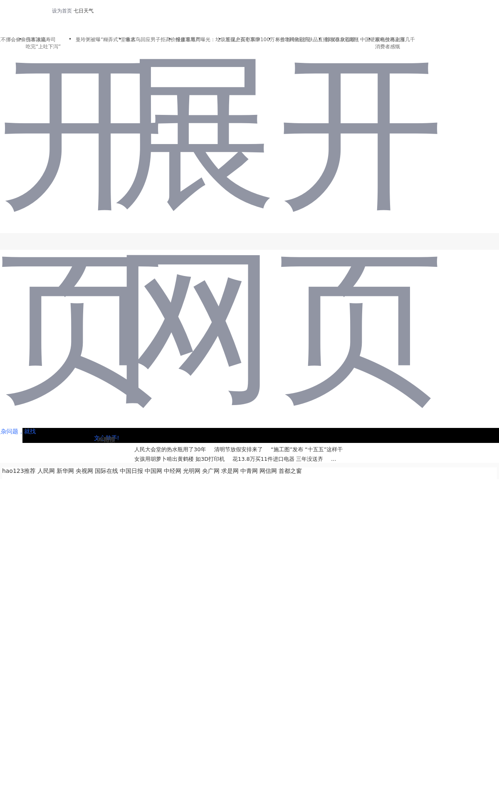

# rENDER

`rENDER` is a self-contained browser engine being built around a new Rust core.
It does not delegate HTML, CSS, JavaScript, layout, or painting to Chromium or a
system WebView. The earlier Python/PyQt implementation remains runnable as a
prototype while standards-correct browser behavior is implemented in Rust.

The project is intentionally hands-on: core subsystems such as parsing, cascade, layout, and painting live in this repository and are readable end to end.

## Current Completion Snapshot

**As of 2026-08-03.** These are engineering estimates for the primary Rust
browser reaching the project's minimum usable scope. They are not WPT,
test262, or web-compatibility pass rates; `100%` means the currently planned
browser scope is implemented and covered well enough to maintain.

| Component | Completion | Current boundary |
| --- | ---: | --- |
| HTML parsing and encoding | 55% | Tokenization, tree construction, recovery, and common Chinese encodings work; full HTML5 edge cases remain. |
| DOM, events, and forms | 40% | Tree mutation, selectors, common events, inputs, and GET submission work; broad Web APIs and event options remain. |
| CSS syntax, selectors, and cascade | 45% | Common selectors, specificity, inheritance, custom properties, and major value grammars work; full CSS syntax and cascade coverage remain. |
| Layout | 48% | Block/inline, floats, positioned boxes, flex, grid, table, overflow, and common sizing work; intrinsic and multi-axis edge cases remain. |
| Painting and images | 42% | CPU display lists, backgrounds, borders, clipping, opacity, transforms, and common raster images work; stacking, replaced-element, and SVG coverage remain. |
| JavaScript runtime | 15% | Common script execution, DOM mutation, promises, timers, and events work; the latest full test262 run is 11,628/98,096 variants passed (11.9%). |
| Network and resources | 50% | TLS HTTP(S), redirects, cookies, gzip/Brotli, CSS, scripts, images, and common lazy-image sources work; Fetch/CORS, cache, and service workers remain. |
| Browser shell and interaction | 55% | Native window, tabs, address editing, history, scrolling, links, forms, and DPI-aware painting work; accessibility and broader input remain. |
| **Overall minimum usable browser** | **42%** | Enough infrastructure exists for iterative Baidu, Zhihu, and 163 compatibility work; this is not a claim of general web compatibility. |

## Highlights

- HTML, CSS, DOM, layout, and painting are implemented in Python.
- Real-page compatibility work is covered by focused regression tests.
- Layout coverage includes block, inline, float, flex, grid, table, and positioned flows.
- The GUI paints after HTML and blocking CSS, then hydrates images, backgrounds,
  and external scripts through a shared parallel resource pool.
- A persistent page session keeps DOM, JavaScript, timers, and rendering invalidation alive after load.
- Headless screenshot tooling and browser-vs-engine visual diff helpers are included.
- WebKit-inspired layout fixtures are imported and adapted into deterministic geometry tests.

## Screenshots

### `example/index.html`


### `example/hao123.html`


## Quick Start

### Rust native browser (experimental)

The all-Rust browser opens a native window and presents the CPU surface produced
by `render-core`; it does not embed Chromium, a system WebView, or the Python
prototype. With no argument it displays the built-in new-tab page:

```powershell
cargo run -p render-browser
```

To open a network page directly:

```powershell
cargo run -p render-browser -- https://www.baidu.com/
```

To open a local HTML file:

```powershell
cargo run -p render-browser -- example/index.html
```

The native chrome provides tabs, an editable address bar, history controls,
window controls, dark-theme colors, and fractional-DPI painting. HTTP/HTTPS
documents load on background Rust workers; HTML encoding detection and external
stylesheets flow into the same DOM/style/layout/paint pipeline. The executable
is still experimental: substantial CSS layout, JavaScript/Web API, media,
images, security isolation, accessibility, and interaction work remains.

### 1. Create an environment

```bash
python -m venv .venv
source .venv/bin/activate
pip install -r requirements-dev.txt
```

On Windows PowerShell:

```powershell
python -m venv .venv
.venv\Scripts\Activate.ps1
pip install -r requirements-dev.txt
```

### 2. Run the browser

```bash
python engine.py
python engine.py example/index.html
python engine.py https://example.com
python engine.py --width 1280 --height 800 example/hao123.html
```

### 3. Render a screenshot

```bash
python screenshot.py example/index.html out.png 1280 900
```

## Development

Run the test suite:

```bash
python -m pytest
```

Run tests with the CI coverage gate:

```bash
python -m pytest --cov --cov-report=term --cov-fail-under=60
```

Testing strategy details: [`docs/testing_strategy.md`](docs/testing_strategy.md).
Generic engine backlog: [`docs/generic-browser-todo.md`](docs/generic-browser-todo.md).
Prioritized improvement plan: [`docs/improvement_plan.md`](docs/improvement_plan.md).

Run syntax and lint checks:

```bash
python -m compileall engine.py screenshot.py css html js layout network rendering tests
python -m ruff check engine.py screenshot.py css html js layout network rendering
```

## Repository Layout

```text
engine.py                Browser entry point and pipeline orchestration
html/                    HTML parser and DOM nodes
css/                     Tokenizer, parser, cascade, computed styles
js/                      Lexer, parser, interpreter, DOM bindings, XHR
layout/                  Block, inline, float, flex, grid, table layout engines
rendering/               Display list and PyQt6 painter backend
network/                 HTTP fetching and response decoding
tests/                   Unit, layout, compatibility, and visual regression helpers
docs/                    Notes, screenshots, and compatibility analysis
example/                 Local HTML fixtures for manual testing
```

## Architecture

The complete headless render path looks like this:

1. Parse HTML into a DOM tree.
2. Fetch external CSS and image resources.
3. Execute supported JavaScript against the DOM.
4. Bind CSS, compute styles, and resolve layout boxes.
5. Paint the display list with the PyQt6 backend.

After the initial load, the page session continues to dispatch DOM click events,
advance timers, and rebuild style/layout/paint output when JavaScript mutates the page.

The interactive GUI uses a progressive variant of that pipeline. It emits the
first display list after HTML and external CSS are ready, while ordinary images,
CSS backgrounds, and external scripts download concurrently. Completed images
are attached in batches so slow or broken archival resources cannot hold the
first visible page hostage.

The central orchestration lives in [`engine.py`](engine.py). Layout engines are split by formatting context under [`layout/`](layout/).

## Rust browser architecture

rENDER's product target is a complete, lightweight desktop browser with a
self-owned Rust engine. Headless automation, deterministic Agent workflows, and
future Python bindings consume the same DOM, event loop, layout, and display
list as the desktop browser; they are not a separate compatibility backend.

Rust-core work currently takes priority over extending the Python prototype,
which is not the behavioral specification. WHATWG/CSS/ECMAScript standards,
WPT/test262, and interoperable browser behavior take precedence. See
[`docs/rust_migration.md`](docs/rust_migration.md) for the architecture,
correctness rules, and subsystem migration policy.

Run the migrated Rust core and Python-binding checks with:

```bash
cargo test --workspace
cargo clippy --workspace --all-targets -- -D warnings
maturin develop --manifest-path bindings/python/Cargo.toml
python -m pytest -q bindings/python/tests
```

## Compatibility Strategy

The project is not trying to mimic every browser subsystem at once. Instead, it improves compatibility through narrow, test-backed slices:

- page-specific regressions captured as unit tests
- page-level rendering contracts for real-world fixture modules
- adapted WebKit layout fixtures
- visual regression helpers for local fixtures and browser diffing
- compatibility notes under `docs/`

Site-specific render adapters and external-browser fallbacks are intentionally out of scope for the runtime engine. Missing capability should be tracked as generic engine work, not patched per site.

This keeps behavior improvements concrete and reviewable.

## Security Model

- TLS certificate errors are fatal and are never retried with verification disabled.
- JavaScript `fetch` and XHR are same-origin only until CORS response handling is implemented.
- Remote pages cannot read `file:` URLs; local file access is enabled only for local documents and their resources.
- Network responses and data URIs have in-memory size limits.

This is still an experimental single-process browser engine, not a hardened sandbox for hostile web content.

## Contributing

See [CONTRIBUTING.md](CONTRIBUTING.md) for setup, review expectations, and change guidelines.

## License

Project source is distributed under the terms in [COPYING](COPYING). PyQt6 is
GPL/commercial dual-licensed, so distributors must also comply with the chosen
PyQt6 license.
